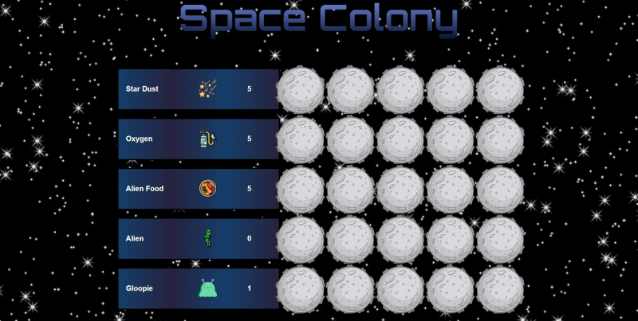
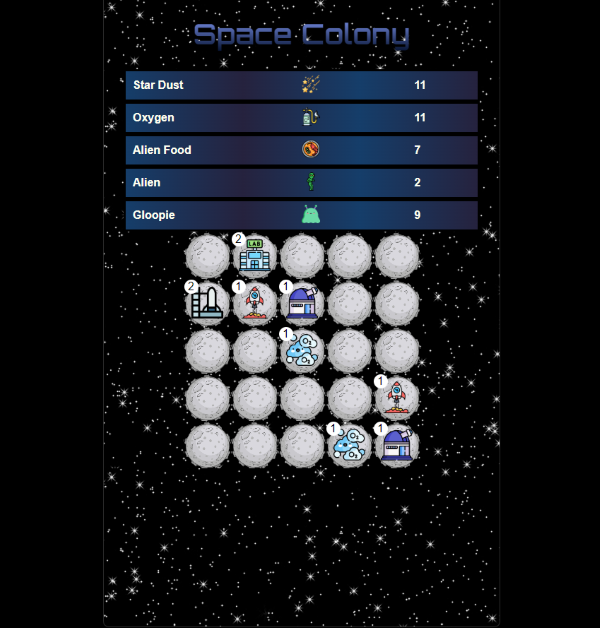
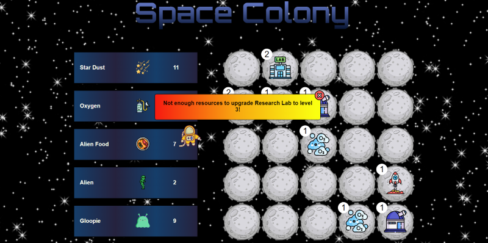

# Space Colony - Village Simulator

## Overview

"Space Colony" is a village simulator game built with React and TypeScript. In this game, players build and manage a space colony by placing improvements on a grid map. The challenge lies in balancing resource consumption and production to expand the colony efficiently.

## Features

- **Dynamic Grid Map**: Interactively build your colony by placing improvements on the map.
- **Resource Management**: Strategically manage resources to grow your colony.
- **Upgrade System**: Enhancements can be upgraded, downgraded, or removed to adapt to your strategy.
- **Responsive Design**: A mobile-first approach for an optimal experience on various devices.
- **Customizable Interface**: Personalize your colony with a range of options.
- **Engaging User Interface**: Intuitive and visually appealing UI elements.

## Technologies Used

- React
- TypeScript
- CSS
- Vite

## Installation

To get "Space Colony" up and running on your local machine, follow these steps:

1. Clone the repository: `git clone https://github.com/tanjennifer/village-simulator-react.git`
2. Navigate to the project directory: `cd space-colony`
3. Install dependencies: `npm install`
4. Start the server: `npm run dev`
5. Visit `http://localhost:5173/` in your browser

## Game Rules

- **Initial Resources**: Start with a basic set of resources.
- **Building Improvements**: Click on the grid cells to add improvements.
- **Resource Balancing**: Keep an eye on your resources to sustain your colony.
- **Colony Upgrades**: Enhance your colony's capabilities by upgrading improvements.

## Live Demo

Experience "Space Colony" live at [Website Link](YOUR_WEBSITE_LINK).
